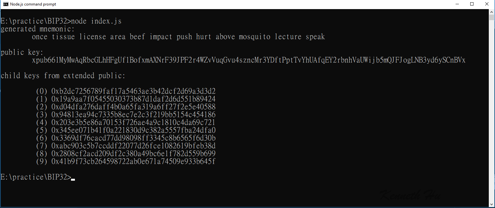

# BIP32
Ethereum Public Child Key address generation from BIP32 Public Parent Key

## HD Wallet API

To use BIP32 HD wallets, first include the `hdkey` submodule:

`var hdkey = require('ethereumjs-wallet/hdkey')`

Constructors:

* `fromMasterSeed(seed)` - create an instance based on a seed
* `fromExtendedKey(key)` - create an instance based on a BIP32 extended private or public key

For the seed  we suggest to use [bip39](https://npmjs.org/package/bip39) to create one from a BIP39 mnemonic.

Instance methods:

* `privateExtendedKey()` - return a BIP32 extended private key (xprv)
* `publicExtendedKey()` - return a BIP32 extended public key (xpub)
* `derivePath(path)` - derive a node based on a path (e.g.  m/44'/0'/0/1)
* `deriveChild(index)` - derive a node based on a child index
* `getWallet()` - return a `Wallet` instance as seen above

Result :

### Source : https://github.com/ethereumjs/ethereumjs-wallet